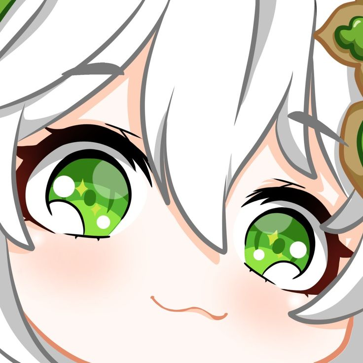
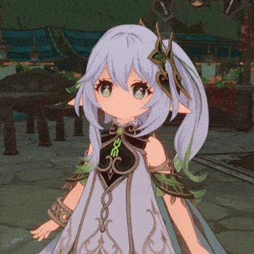

<body>

<h1 align="center">
  
    𝓦𝓮𝓵𝓬𝓸𝓶𝓮 𝓽𝓸 𝓶𝔂 𝓟𝓻𝓸𝓯𝓲𝓵𝓮 
   
</h1>

 

  

  <h2 align="center">
    
      𝓐𝓫𝓸𝓾𝓽 𝓶𝓮 
    
  </h2>

  

    
  

  <li>
    <b>Name:</b> Jonathan Zefanya
  </li>
  <li>
    <b>Major:</b> Informatics Engineering
  </li>
  <li>
    <b>Loves:</b> anime, RPG Game
  </li>
  <li>
    <b>Gender:</b> Male
  </li>
  <li>
    <b>Address:</b> Indonesian
  </li>
  <li>
    <b>Hobbys:</b> Software Development, Gaming, Writer
  </li>
  <li>
    <b>University :</b> Institut Teknologi Indonesia 
  </li>
     

<h2 align="center">
  
    𝓚𝓷𝓸𝔀𝓵𝓮𝓭𝓰𝓮
   
</h2>

 

  

    
  

   

  

    
    
    
    
    
    
    
    
    
    
      
    
    
    
    
    
    
    
    
    
    
    
      
    
    As an enthusiastic student, I am passionate about creating engaging digital experiences and always strive to deliver the best solutions in every project I undertake.
  

 

<h2 align="center">⚔️ 𝓜𝔂 𝓢𝓽𝓪𝓽𝓾𝓼 ⚔️</h2>

  
  

 

<h2 align="center">📝 𝓒𝓸𝓷𝓽𝓪𝓬𝓽 𝓶𝓮  📝</h2>
  

    
  

 
 
 

  
Here are some of my  
  most used social media i used  
  

  

    
    
  

 

  <h2 align="center">💖 𝓣𝓱𝓪𝓷𝓴𝓼 𝓕𝓸𝓻 𝓥𝓲𝓼𝓲𝓽𝓲𝓷𝓰! 💖</h2>
  

    

      <!--  -->
      
    

  

    

</body>