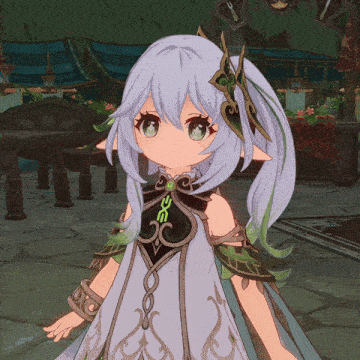

#  Welcome To My Profile 

## Hi, I'm Jonathan Zefanya 

### Fullstack Web & Mobile Developer

 

<table align="center" style="border: none; width: 100%;">
  <tr style="border: none;">
    <td width="62%" valign="top" style="border: none;">

### 
  About Me 

- 💼 **Role:** Fullstack Web & Mobile Developer
- 🚀 Also running my own software venture on the side
- 🎮 Big fan of **anime** & **RPG games** — Genshin Impact especially
- 📍 **Location:** Indonesia
- ✍️ **Hobbies:** Software development, gaming, writing

</td>
<td width="38%" align="center" style="border: none;">
      
    </td>
  </tr>
</table>

 

## 🛠️ Tech Stack 🛠️

**Languages**
 
&nbsp;&nbsp;
&nbsp;&nbsp;
&nbsp;&nbsp;
&nbsp;&nbsp;

 

**Frameworks & Libraries**
 
&nbsp;&nbsp;
&nbsp;&nbsp;
&nbsp;&nbsp;
&nbsp;&nbsp;
&nbsp;&nbsp;
&nbsp;&nbsp;

 

**Database & Tools**
 
&nbsp;&nbsp;
&nbsp;&nbsp;
&nbsp;&nbsp;
&nsbp;&nsbp;

 

## ⚔️ My Status ⚔️

 

 

## </> Let's Connect </>

 

### Thanks for visit my profile

